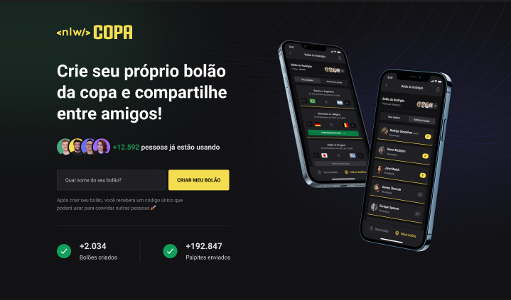

  <h1> World Cup Polls </h1>

 

  

 
 

 <a href="#theproject">The Project</a> •
 <a href="#target">Target</a> •
 <a href="#technologies">Technologies</a> •
 <a href="#route">Route</a> •
 <a href="#howtouse">How to Use</a>

 

<h2> 📓 The Project </h2>

 NLW World Cup platform to create your own cup poll and share it with friends (web platform and mobile) 

<h2> 💡 Target </h2>
Development of an NLW World Cup platform to create your own cup poll and share it with friends (web platform and mobile versions) at NLW (Next Level Week), from Rocketseat

 

<h2> 🛠 Technologies </h2>
The following tools were used in building the project:  

|                       Type                       |           Tools           |            References             |
| :----------------------------------------------: | :-----------------------: | :-------------------------------: |
|                       IDE                        |          VS CODE          |  https://code.visualstudio.com/                |
|              Design Interface Tool               | FIGMA (Prototype - UX/UI) |      https://www.figma.com/                |
|         Programming Language (Frontend)          |           REACT           |       https://reactjs.org/                |
|          Programming Language (Mobile)           |       REACT NATIVE        |     https://reactnative.dev/                |
| Programming Language (Backend, Frontend, Mobile) |        TYPESCRIPT         |  https://www.typescriptlang.org/ |
|        API and backend services (Backend)        |          NODE.JS          |        https://nodejs.org/                |
|          NodeJS web framework (Backend)          |          FASTIFY          |      https://www.fastify.io/                |
| Open source API development ecosystem (Testing)  |        HOPPSCOTCH         |      https://hoppscotch.io/                 |
|          Open source platform (Mobile)           |    EXPO BARE WORKFLOW     |         https://expo.dev/                |
|         The React Framework (Frontend)           |          NEXT.JS          |     https://nextjs.org/                |
|      Utility-first CSS Framework (Frontend)       |       TAILWIND CSS        |     https://tailwindcss.com/                |
|    Tool for transforming CSS with JavaScript     |         POST CSS          |       https://postcss.org/                |
|      Graphic components (Frontend, Mobile)       |      PHOSPHOR ICONS       |    https://phosphoricons.com/                |
|    UI Utility-first Component Library (Mobile)    |        NATIVE BASE        |      https://nativebase.io/                 |
|        Navigation between pages (Mobile)         |     REACT NAVIGATION      |  https://reactnavigation.org/                |
|                Database (Backend)                |          SQLITE           | https://www.sqlite.org/index.html                |
|  Promise based HTTP client - browser & Node.js   |           AXIOS           |      https://axios-http.com/                |
|             UI Components for React              |         RADIX-UI          |     https://www.radix-ui.com/                |
|  Node.js and TypeScript ORM (Backend, Database)  |          PRISMA           |      https://www.prisma.io/                 |
|                      Security                    |            JWT            |      https://jwt.io/                 |
 

  <h3>Backend | API</h3>
  
  <!--  -->
  
  
   
  
   
  <h3>Testing</h3>
  
   
  <h3>Database</h3>
  
  
   
  <h3>IDE</h3>
  
   
  <h3>UX/UI</h3>
  
  
  
   
  <h3>Frontend</h3>
  
  
  
   
  
  
   
  <h3>Mobile</h3>
  
  
  
  
   

<h2> 🔎 Route </h2>
  <ol>
    <li &nbsp;>Part 1 - Starting the Project 
      <ul &nbsp;>
        <li &nbsp;>Build the project prototype: https://www.figma.com/file/iaK2Ajow4JRBce1EryNJR2/Bol%C3%A3o-da-Copa-(Community)?node-id=1%3A2</li>
        <li>Install VS Code (IDE)</li>
        <li>Install VS Code extensions: NodeJS, Prisma, SQLite, Tailwind CSS IntelliSense, PostCSS Language Support</li>
        <li &nbsp;><b>Backend project</b>
          <ul>
            <li>Create a new project: mkdir backend</li>
            <li>Enter backend project: cd backend</li>
            <li>Install Node and start: npm init -y</li>
            <li>Install Fastify framework: npm i fastify</li>
            <li>Configure server and ports: ./src/server.ts</li>
            <li>Install TypeScript for development environment:
              <ul>
                <li>npm i typescript -D</li>
                <li>npx tsc --init (Settings file for TS)</li>
                <li>npm i tsx -D (Automatically updates)</li>
                <li>Change ts config file: ./tsconfig.json</li>
              </ul>
            </li>
            <li>Configure the package.json: ./package.json </li>
            <li>Run the application: npm run dev</li>
            <li>Define "Use Cases"</li>
            <li>Set routes: ./src/server.ts</li>
            <li>Install and set Prisma
              <ul>
                <li>Install (for development): npm i prisma -D</li>
                <li>Install Prisma Client: npm i @prisma/client</li>
                <li>Install Prisma ERD Generator: npm i prisma-erd-generator @mermaid-js/mermaid-cli -D</li>
                <li>Set Database SQLite: npx prisma init --datasource-provider SQLite</li>
                <li>Create tables and entities: ./prisma/schema.prisma</li>
                <li>Run migrations: npx prisma migrate dev
                  <ul>
                    <li>Name for the new migration: create table polls</li>
                  </ul>
                </li>
                <li>To see DB generated from Prisma: npx prisma studio</li>
                <li>Generate: npx prisma generate</li>
              </ul>
            </li>
            <li>Cors library (Protection for non-desirable access): npm i @fastify/cors</li>
          </ul>
        </li>
        <li &nbsp;><b>Frontend project</b>
          <ul>
            <li>Create the frontend project (React, Next.js and TypeScript): npx create-next-app@latest --use-npm </li>
            <li>Set HTTP requisition on Server Side Handler with Next.JS: ./pages/index.tsx</li>
            <li>To run project: npm run dev</li>
          </ul>
        </li>
        <li &nbsp;><b>Mobile project</b>
          <ul>
            <li>Install "R Component" extension at VS Code</li>
            <li>Install Expo CLI: npm install --global expo-cli</li>
            <li>Create a new project: npx create-expo-app mobile</li>
            <li>Navigate to project directory: cd mobile</li>
            <li>Open the project on VS Code: code .</li>
            <li>Change App.js to App.tsx</li>
            <li>Create and set tsconfig.json at root</li>
            <li>Run Expo Go: npx expo start</li>
            <li>Install Native Base on project:
              <ul>
                <li>npm install native-base</li>
                <li>npx expo install react-native-svg </li>
                <li>npx expo install react-native-safe-area-context</li>
              </ul>
            </li>
            <li>Install React Navigation on project:
              <ul>
                <li>npx expo install @react-navigation/native</li>
                <li>npx expo install react-native-screens</li>
                <li>npx expo install react-native-safe-area-context</li>
                <li>npx expo install @react-navigation/native-stack</li>
              </ul>
            </li>
            <li>Install Google Fonts: npx expo install expo-font @expo-google-fonts/roboto</li>
            <li>Install Linear Gradient libary: npx expo install expo-linear-gradient</li>
            <li>Set images, theme and utils for the project: ./src/styles/theme.ts</li>
            <li>Create the Splash Page</li>
            <li>Create components: Loading </li>
            <li>Create screens: SignIn</li>
            <li>Use React Hooks: useState, useEffect, ...</li>
            <li>Start the development server: npx expo start</li>
            <li>Configure the Expo Go on a mobile device or use an emulator</li>
            <li>Open the app on a mobile device:
              <ul>
                <li>On your iPhone or iPad, open the default Apple "Camera" app and scan the QR code you see in the terminal</li>
                <li>On your Android device, press "Scan QR Code" on the "Projects" tab of the Expo Go app and scan the QR code you see in the terminal.</li>
              </ul>
            </li>
          </ul>
        </li>
      </ul>
    </li>
     
    <li &nbsp;>Part 2 - Creating routes and access 
      <ul &nbsp;>
        <li &nbsp;><b>Backend project</b>
          <ul>
            <li>Relation between entities: ./prisma/schema.prisma</li>
            <li>Run migrations: npx prisma migrate dev
              <ul>
                <li>Name for the new migration: create db structure</li>
              </ul>
            </li>
            <li>Seeders:
              <ul>
                <li>Create new seed file: create table polls</li>
                <li>Configure the package.json: ./package.json </li>
                <li>Run: npx prisma db seed</li>
              </ul>
            </li>
            <li>Install libraries:
              <ul>
                <li>ZOD library (validation): npm i zod</li>
                <li>Short Unique ID library: npm i short-unique-id</li>
              </ul>
            <li>
            <li>Create new routes: ./src/server.ts
              <ul>
                <li>Create new bet/poll</li>
                <li>Count guesses</li>
                <li>Count polls</li>
                <li>Count users</li>
              </ul>
            </li>
            <li>:</li>
          </ul>
        </li>
        <li &nbsp;><b>Testing</b>
          <ul>
            <li>Install Hoppscotch app and the extension for Chrome: https://hoppscotch.io/</li>
          </ul>
        </li>
        <li &nbsp;><b>Frontend project</b>
          <ul>
            <li>Install Tailwind CSS, PostCSS and autoprefixer: npm i tailwindcss postcss autoprefixer -D</li>
            <li>Start Tailwind CSS: npx tailwindcss init -p</li>
            <li>Customize contents, themes, fonts and plugins with Tailwind: ./tailwind.config.js</li>
            <li>Customize the main style: ./src/styles/global.css</li>
            <li>Install Axios library: npm i axios</li>
            <li>Set API connection: ./src/lib/axios.ts</li>
            <li>Set Google Fonts: ./src/pages/_document.tsx</li>
            <li>Set the Landing Page: ./src/pages/_app.tsx</li>
          </ul>
        </li>
      </ul>
     
    <li &nbsp;>Part 3 - Mobile layout and visual structure 
      <ul &nbsp;> 
        <li &nbsp;><b>Mobile project</b>
          <ul>
            <li>Authentication Interface: ./src/screens/SignIn.tsx
              <ul>
                <li>React Native SVG Transformer library: npm i react-native-svg-transformer</li>
                <li>Configure the react native packager: ./metro.config.js</li>
                <li>Create types file: ./src/@types/svg.d.ts</li>
                <li>Create Button component: ./src/components/Button.tsx</li>
                <li>Set SignIn interface</li>
              </ul>
            </li>
            <li>Authentication Context: ./src/contexts/AuthContext.tsx
              <ul>
                <li>Create Hook: ./src/hooks/useAuth.tsx</li>
                <li>Use Hook at ./src/screens/SignIn.tsx</li>
                <li>Apply context at: ./App.tsx</li>
              </ul>
            </li>
            <li>Google Authentication: 
              <ul>
                <li>Install expo-auth-session: npx expo install expo-auth-session expo-random</li>
                <li>Install expo-web-browser: npx expo install expo-web-browser</li>
                <li>Create a schema: ./app.json</li>
                <li>Login to Expo by terminal: npx expo login</li>
                <li>Set OAuth with Google (https://console.cloud.google.com)</li>
                <li>Apply Google authentication: ./src/screens/SignIn.tsx</li>
              </ul>
            </li>
            <li>Interface to create and find poll:
              <ul>
                <li>React Native Phosphor Icon Library: npm install --save phosphor-react-native</li>
                <li>React Native Country Flag: npm i react-native-country-flag</li>
                <li>React Native Country List: npm i country-list</li>
                <li>Create and apply components: Button, ButtonIcon, EmptyMyPollList, ... </li>
                <li>Create interface New: ./src/screens/New.tsx</li>
                <li>Create interface Find: ./src/screens/Find.tsx</li>
              </ul>
            </li>
            <li>Polls interface: ./src/screens/polls.tsx</li>
          </ul>
        </li>
      </ul>
    </li>
     
    <li &nbsp;>Part 4 - Connecting mobile app to API 
      <ul &nbsp;>
        <li &nbsp;><b>Backend project</b>
          <ul>
            <li>Separate database connection: ./src/lib/prisma.ts</li>
            <li>Routes: ./src/routes/
              <ul>
                <li>Separate files</li>
                <li>Profile route (/me)</li>
              </ul>
            </li>
            <li>Create an user (Google Access Token)</li>
            <li>JWT (JSON Web Token)
              <ul>
                <li>Fastify JWT: npm i @fastify/jwt</li>
                <li>JWT Generation: ./src/routes/auth.ts</li>
                <li>JWT Validation: ./src/plugins/authenticate.ts</li>
              </ul>
            </li>
            <li>Polls: ./src/routes/poll.ts
              <ul>
                <li>Create a poll with a logged user</li>
                <li>Enter in a poll</li>
                <li>Polls that an user participate</li>
                <li>Poll details</li>
                <li>List of games of a poll</li>
              </ul>
            </li>
            <li>Create a guess: ./src/routes/guess.ts</li>
          </ul>
        </li>
        <li &nbsp;><b>Testing</b>
          <ul>
            <li>Test backend at Hoppscotch: https://hoppscotch.io/</li>
          </ul>
        </li>
        <li &nbsp;><b>Mobile project</b>
          <ul>
            <li>Navigation
              <ul>
                <li>React Navigation: npm install @react-navigation/native @react-navigation/bottom-tabs</li>
                <li>Install dependencies: npx expo install react-native-screens react-native-safe-area-context</li>
                <li>Native Stack Navigator: ./src/routes/app.routes.tsx</li>
                <li>Navigation Strategy: ./src/routes/index.tsx</li>
                <li>Customizing Bottom Tabs</li>
                <li>Navigate through application</li>
                <li>Comunnicate to TS which routes are available: ./src/@types/navigation.d.ts</li>
              </ul>
            </li>
            <li>Connect with API (backend service)
              <ul>
                <li>Axios: npm i axios</li>
                <li>Set API access</li>
                <li>Search user data on backend: ./src/contexts/AuthContext.tsx</li>
                <li>Insert token at requests header</li>
                <li>Redirect user to application routes</li>
              </ul>
            </li>
          </ul>
        </li>
      </ul> 
    </li> 
     
    <li &nbsp;>Part 5 - Finishing app and features 
      <ul &nbsp;>
        <li &nbsp;><b>Frontend project</b>
          <ul>
            <li>Create component: CreateAdModal</li>
            <li>Use Radix UI Components 
              <ul>
                <li>Checkbox = npm install @radix-ui/react-checkbox</li>
                <li>Select = npm install @radix-ui/react-select</li>
                <li>Toggle Group = npm install @radix-ui/react-toggle-group</li>
              </ul>
            </li>
            <li>Send Ad modal values to API (backend service)
              <ul>
                <li>Axios: npm install axios</li>
              </ul>
            </li>
          </ul>
        </li>
        <li &nbsp;><b>Mobile project</b>
          <ul>
            <li>Create component: DuoMatch (Modal)</li>
            <li>Set navigation from Game modal to DuoMatch (modal)</li>
            <li>Use UI Icons
              <ul>
                <li>Vector-Icons (Expo): MaterialIcons</li>
                <li>Phosphor Icon React Native: CheckCircle </li>
                <li>Comunnicate to TS which routes are available: ./src/@types/navigation.d.ts</li>
              </ul>
            </li>
            <li>New Features
              <ol>
                <li>Condional open and close DuoMatch (modal) from Game page (screen)</li>
                <li>Open DuoMatch (modal) when click at Connect button on Game page (screen)</li>
                <li>When click at discordUser from DuoMatch (modal), keep this info to transfer area
                  <ul>
                    <li>Clipboard library: expo install expo-clipboard</li>
                  </ul>
                </li>
                <li>Sending notifications (push), when keeping discordUser at device clipboard
                  <ul>
                    <li>Expo Notifications library: expo install expo-notifications</li>
                    <li>New Services
                      <ul>
                        <li>Set user notifications configuration from this app</li>
                        <li>Find device identificator token (getPushNotificationToken)</li>
                        <li>Expo Modules Core library: expo install expo-modules-core</li>
                        <li>Keep some devices references (useRef hook): getNotificationListener, responseNotificationListener</li>
                        <li>Send the notification to an specific device by notification token </li>
                      </ul>
                    </li>
                  </ul>
                </li>
                <li> Link with Discord Session
                  <ul>
                    <li>Expo AuthSession library: expo install expo-auth-session expo-random </li>
                    <li>Create a new Screen: SignIn (./src/screens/SignIn/index.tsx)</li>
                    <li>Get Discord Authentication URL: http://discord.com/developers/applications</li>
                  </ul>
                </li>
              </ol>
            </li>
            <li>Before executing app:
              <ol>
                <li>At terminal: expo login</li>
                <li>Enter your login credentials (user and password)</li>
              </ol>
            </li>
            <li>Start the app with expo: expo start</li>
            <li>Test notifications using web interface (Push notifications tools): http://expo.dev/notifications</li>
          </ul>
        </li>
      </ul> 
    </li>
     
  </ol>

 

<h2>🧪 How to use</h2>
  <ol &nbsp;>
    <li &nbsp;>Set the development environment at you local computer</li>
    <li &nbsp;>Clone the repository
      <ul>
        <li>git clone https://github.com/alexandrecpedro/eSports</li>
      </ul>
    </li>
    <li &nbsp;>Enter the project directory:
      <ul>
        <li>cd eSports</li>
      </ul>
    </li>
    <li><b>Testing</b>
      <ul>
        <li &nbsp;><u>Backend</u>
          <ol>
            <li &nbsp;>Enter the directory
              <ul>
                <li>cd backend</li>
              </ul>
            </li>
            <li &nbsp;>Install the dependencies
              <ul>
                <li>npm install</li>
              </ul>
            </li>
            <li &nbsp;>Run
              <ul>
                <li>npm run dev</li>
              </ul>
            </li>
          </ol>
        </li>
        <li &nbsp;><u>Frontend</u>
          <ol>
            <li &nbsp;>Enter the directory
              <ul>
                <li>cd frontend</li>
              </ul>
            </li>
            <li &nbsp;>Install the dependencies
              <ul>
                <li>npm install</li>
              </ul>
            </li>
            <li &nbsp;>Run
              <ul>
                <li>npm run dev</li>
              </ul>
            </li>
          </ol>
        </li>
        <li &nbsp;><u>Mobile</u>
          <ol>
            <li &nbsp;>Enter the directory
              <ul>
                <li>cd mobile</li>
              </ul>
            </li>
            <li &nbsp;>Before run the mobile app, check if the following tools are already installed:
              <ul>
                <li &nbsp;><u>Node.js LTS release</u>
                  <ul>
                    <li>https://nodejs.org/en/</li>
                  </ul>
                </li>
                <li &nbsp;><u>Git</u>
                  <ul>
                    <li>https://git-scm.com/downloads</li>
                  </ul>
                </li>
                <li &nbsp;><u>Watchman (only for MacOS and Linux users)</u>
                  <ul>
                    <li>https://facebook.github.io/watchman/docs/install#buildinstall</li>
                  </ul>
                </li>
                <li &nbsp;><u>Expo CLI</u>
                  <ul>
                    <li>npm install --global expo-cli</li>
                  </ul>
                </li>
              </ul>
            </li>
            <li &nbsp;>Install the dependencies
              <ul>
                <li>npx install-expo-modules@latest</li>
                <li &nbsp;>npm install expo</li>
                <li &nbsp;>expo install</li>
              </ul>
            </li>
            <li &nbsp;>Run
              <ul>
                <li>npx expo start</li>
              </ul>
            </li>
          </ol>
        </li>
      </ul>
    </li>
  </ol>

